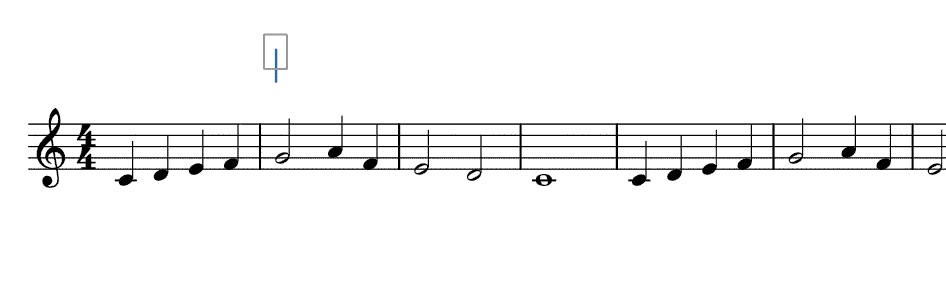

# Electone Regist Font

エレクトーンの楽譜によく使用されている レジストを表す画像 をフォントとして作ってみました。

自作エレクトーン楽譜を作成する際に利用できます。

**注意**
本フォントは 合字 に対応していないソフトでは正しく表示されません。ご了承ください。

## 動作確認済みソフト

- MuseScore

※ 上記リストに載っていないソフトで使用できた方は [X(Twitter) @SuzuTomo2001](https://x.com/SuzuTomo2001) のDMまで知らせていただけると幸いです。

## インストール法（Windows の場合）

1. 上部のリンクからフォントをダウンロードし、解凍します
1. 解凍したフォルダ内にある `ElectonrRegist.ttf` を右クリックし、「インストール」を選択してフォントをインストールします

## 入力方法

本フォントは「合字（リガチャ）」という仕組みを応用して作っています。
合字とは 2 文字以上の文字を 1 文字として表示する文字のことです。

- レジスト 1 ~ 9 は通常通り「1」「2」などと入力します
- レジスト 10 ~ 16 は文字通り「10」「11」などと入力します
- Aバンクのレジスト 1 ~ 9 は「A1」「A2」などと入力します
- Aバンクのレジスト 10 ~ 16 は「A10」「A11」などと入力します

なお、使用するソフトによっては、入力後にスペースを入れないと合字として判定されない場合もありますので、うまく表示されない場合は「A12_」（_はスペース）のようにスペースを入れてみてください。

## Electone Regist Fontについて

レジストのデザインはエレクトーンの既成楽譜にあるものを参考にしました。

フォント自体は [Roboto](https://github.com/googlefonts/roboto) をベースに [FontForge](https://fontforge.org/en-US/) にて作りました。レジスト以外の文字（1~9以外）は Roboto のフォントでそのまま描画されます。

なお、レジストに用いられている文字（数字や "MEMORY"、A~E）にも Roboto が使用されています。

## ライセンス

本フォントはベースとなった Roboto と同じ Apache License となっています。
ライセンス全文は [LICENSE.txt](LICENSE.txt) をご覧ください。

ざっくり言いますと、楽譜作成に用いる分には（楽譜を有償で販売したとしても）何もしなくても問題ないはずなので、ぜひ使ってください！

## 不具合・お問い合わせ

本フォントに関する不具合・改善などありましたら、[Github の Issue](https://github.com/kamekyame/electone-regist-font/issues) または [X(Twitter) @SuzuTomo2001](https://x.com/SuzuTomo2001) までお願いします。
